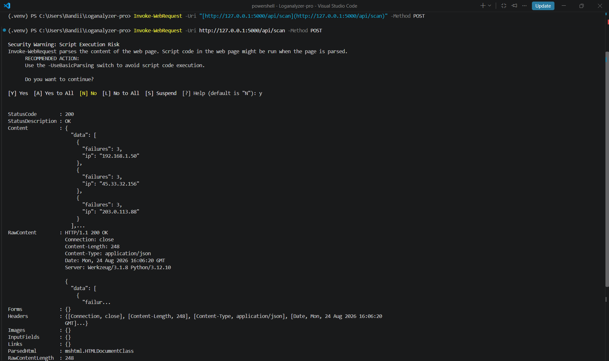
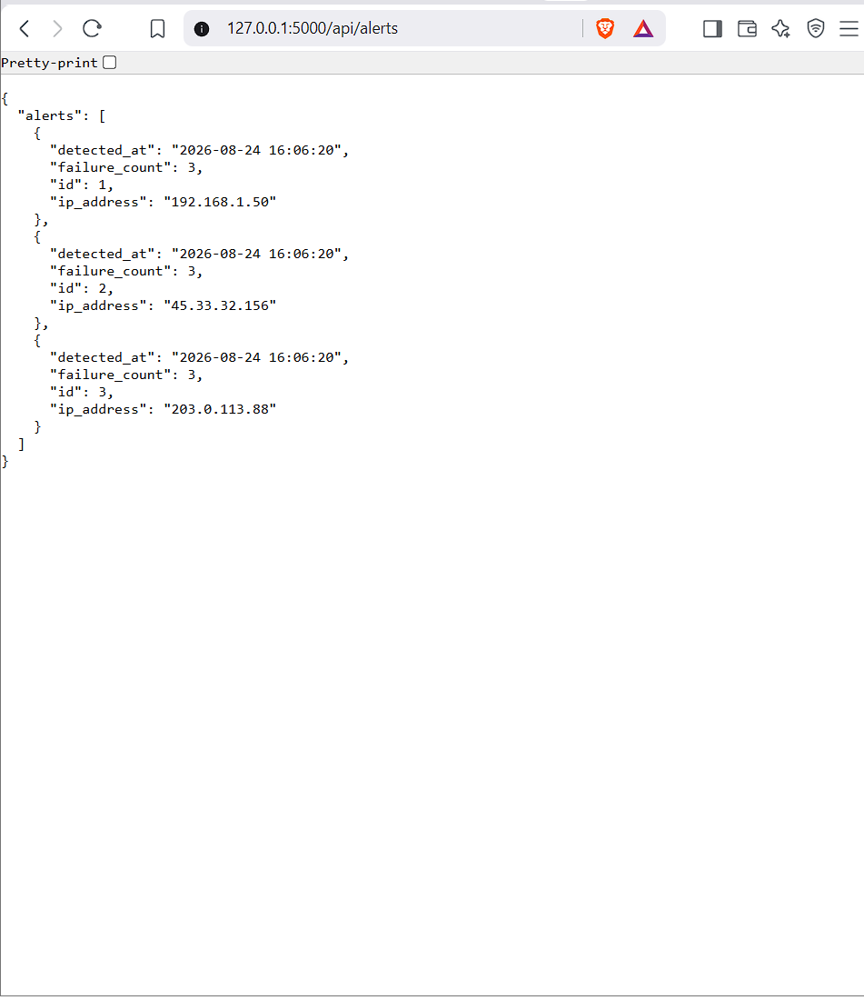

# LogAnalyzer Pro

LogAnalyzer Pro is a lightweight cybersecurity utility designed to parse system authentication logs, identify potential brute-force attack patterns using regular expressions, and store the flagged threat data in a local database via a Flask RESTful API. This project showcases core competencies in Python programming, log analysis, backend API development, and security monitoring.

## Technical Stack
Language: Python
Backend Framework: Flask
Database: SQLite
Core Modules: Regular Expressions (Regex), sqlite3

## Setup and Installation
1. Clone this repository to your local machine.
2. Create and activate a Python virtual environment:
   python -m venv .venv
   .\.venv\Scripts\Activate
3. Install the required dependencies:
   python -m pip install Flask
4. Start the Flask application:
   python app.py

## Execution and Testing
1. Send a POST request to trigger the log parsing and database insertion:
   Invoke-WebRequest -Uri http://127.0.0.1:5000/api/scan -Method POST
2. Open your web browser and navigate to the following endpoint to view the stored security alerts in JSON format:
   http://127.0.0.1:5000/api/alerts

## Evidence of Execution

### Flask Server and Log Scan Execution

### API Alert Output in Browser

=======
# LogAnalyzer-Pro
A Python-based security log parser and Flask backend for detecting brute-force attacks and managing threat alerts.

